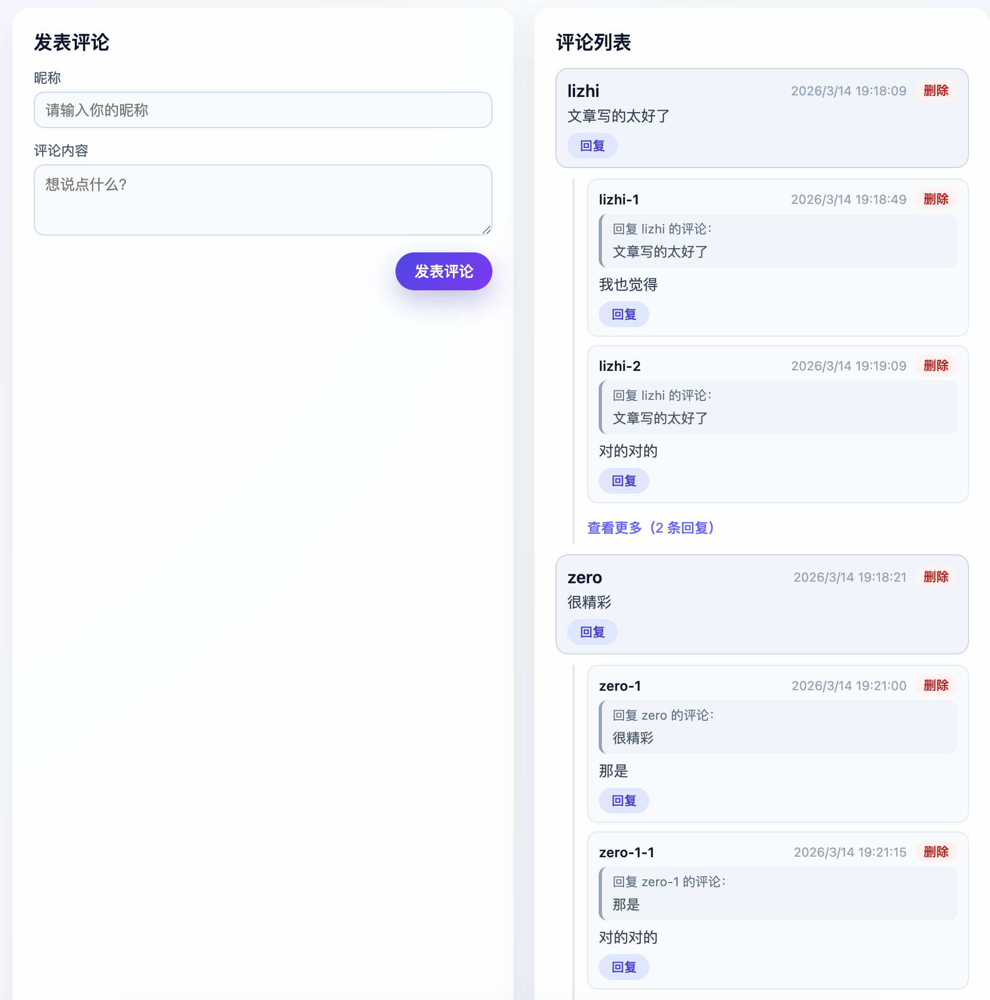

# 简单评论系统（Go + React）

一个演示用的前后端分离评论系统：**后端** Go + Gin + GORM + MySQL，**前端** React + Vite + TypeScript。支持两级评论（根评论 + 回复）、分页、查看更多/加载更多、删除，可通过 Docker Compose 一键部署。



---

## 功能说明

- **发表评论**：填写昵称与内容即可发布根评论。
- **回复**：可回复根评论或楼内任意一条回复；展示「回复 xxx 的评论」及被回复内容摘要。
- **列表**：一级评论分页（每页 10 条），每条带回复总数与最多 2 条预览回复。
- **查看更多**：点击后拉取该楼全部回复（分页，每批 20 条），支持「加载更多」。
- **删除**：单条评论软删除；被回复评论删除后，其回复不再展示。

---

## 本地开发（非 Docker）

### 环境要求

- Go 1.21+
- Node.js 18+
- MySQL 8.x

### 1. 数据库

创建库并执行建表脚本：

```bash
mysql -u root -p -e "CREATE DATABASE IF NOT EXISTS simple_comment CHARACTER SET utf8mb4 COLLATE utf8mb4_unicode_ci;"
mysql -u root -p simple_comment < backend/migrations/comments.sql
```

### 2. 启动后端

```bash
cd backend
go mod tidy
# 按需设置环境变量（不设置则用默认：连 localhost:3306，库 simple_comment）
export DB_HOST=127.0.0.1
export DB_PORT=3306
export DB_USER=root
export DB_PASSWORD=你的密码
export DB_NAME=simple_comment
export APP_PORT=8081

go run ./cmd/server
```

后端默认监听 `http://localhost:8081`，健康检查：`GET http://localhost:8081/ping`。

### 3. 启动前端（开发模式）

```bash
cd frontend
npm install
npm run dev
```

浏览器访问 **http://localhost:5173**。  
前端默认通过相对路径 `/api` 请求后端；若后端不在同域，在 `frontend/.env.development` 中配置：

```bash
VITE_API_BASE_URL=http://localhost:8081/api
```

并在 Vite 中配置代理，或后端开启 CORS。

---

## 使用 Docker 部署（推荐）

在项目根目录执行：

```bash
cd deploy
docker compose up --build -d
```

- **前端页面**：http://localhost:8080  
- **后端 API**：http://localhost:8081（如直接调接口）

MySQL 首次启动时会自动执行 `backend/migrations/` 下的 SQL（表结构来自 `comments.sql`）。数据持久化在 Docker volume `mysql_data`。

### 常用命令

```bash
cd deploy
docker compose up -d      # 后台启动
docker compose logs -f    # 查看日志
docker compose down       # 停止并删除容器（保留 volume）
docker compose down -v    # 停止并删除容器与数据卷
```

### 自定义配置

复制 `deploy/.env.example` 为 `deploy/.env`，按需修改数据库与端口等；`docker-compose.yml` 中通过 `environment` 传入后端，无需改代码。

---

## 生产部署要点

1. **数据库**：使用正式 MySQL，并定期备份；为 `simple_comment` 库创建专用账号并限制权限。
2. **后端**：通过 `APP_PORT`、`DB_*` 等环境变量配置端口与数据库连接，不要写死密码。
3. **前端**：构建时可通过 `VITE_API_BASE_URL` 指定 API 根地址（如 `https://api.example.com/api`）；Docker 部署时由 Nginx 将 `/api` 反向代理到后端服务。
4. **HTTPS**：在 Nginx 或前置负载均衡上配置 SSL，并视情况设置 `X-Forwarded-Proto` 等头。

---

## 项目结构概览

```
simple-comment/
├── backend/                 # Go 后端
│   ├── cmd/server/          # 入口
│   ├── internal/
│   │   ├── config/          # 配置
│   │   ├── handler/         # HTTP 处理
│   │   ├── model/           # 数据模型
│   │   ├── repository/      # 数据访问
│   │   ├── router/          # 路由与依赖注入
│   │   └── service/         # 业务逻辑
│   └── migrations/
│       └── comments.sql     # 评论表结构
├── frontend/                # React 前端
│   ├── src/
│   │   ├── api/             # 接口封装
│   │   ├── components/      # 评论表单、列表等
│   │   └── types/           # TS 类型
│   └── index.html
└── deploy/                  # 部署相关
    ├── docker-compose.yml
    ├── backend.Dockerfile
    ├── frontend.Dockerfile
    ├── nginx.conf            # 前端 + /api 反代
    └── .env.example
```

---

## API 简要说明

| 方法 | 路径 | 说明 |
|------|------|------|
| GET | `/api/comments` | 一级评论分页，query: `articleId`, `page`, `pageSize` |
| GET | `/api/comments/replies` | 某楼回复分页，query: `parentId`（根评论 id）, `offset`, `limit` |
| POST | `/api/comments` | 发表/回复，body: `articleId`, `parentId`, `userName`, `content` 等 |
| DELETE | `/api/comments/:id` | 软删除指定评论 |

所有接口返回形如 `{ code, msg, data }`；列表类在 `data` 中带 `items`、`total`。
